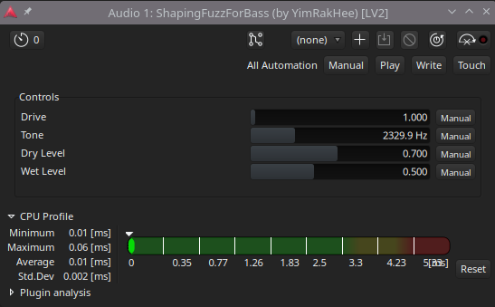

## ShapingFuzzForBass 
Warm Waveshaping Fuzz LV2 plugin for Bass guitar. <br> 
Unlike traditional hard-clipping fuzzes, it utilizes a soft-clipping technique based on a high-speed `tanh` approximation. <br><br>
No GUI.<br>
Tested Environment: Arch Linux / Ardour.<br>



### Features
- Uses a Pade-approximated `fast_tanh` algorithm to minimize CPU usage while generating smooth, musical distortion.
- Parallel Processing Offers independent controls for Dry (original) and Wet (fuzz) signals. This allows you to maintain the low-end "punch" of your bass while layering the fuzz on top.
- Includes a 1st-order IIR Low-Pass Filter to tame harsh high-end frequencies and shape the character of the fuzz.
- Filter coefficients are pre-calculated outside the audio loop to ensure maximum efficiency during real-time processing.

### Requirements
- LV2 SDK
- C++20 compatible compiler (GCC/Clang)
- CMake

### Build & Install(LINUX)
```bash
# Clone the repository
git clone https://github.com/YimRakHee/ShapingFuzzForBass.git
cd ShapingFuzzForBass

# Create a build directory
mkdir build && cd build

# Configure CMake and compile
cmake ..
make

# Install the plugin (installs to ~/.lv2/ by default)
make install
```

